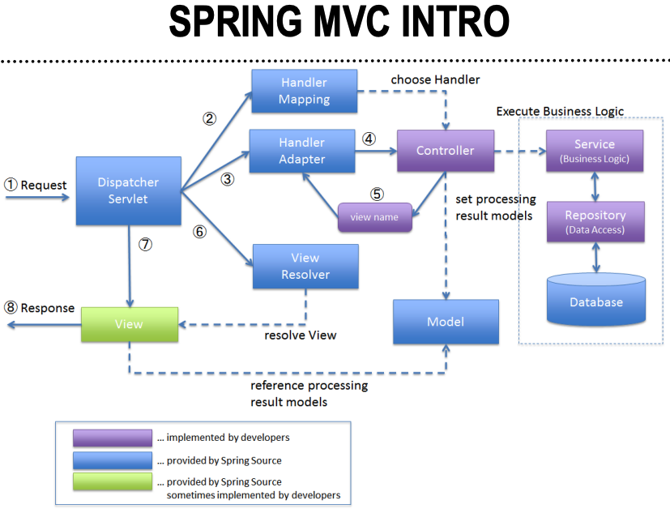

<!--  -->


# General description

**SmartLoanApp** is a modular full-stack application that simulates a modern, secure, and ESG-aware loan management platform. The system is composed of three core components:
1. A **Spring Boot REST API** (SmartLoanAppAPI) that handles business logic, loan processing, and secure user interactions.
2. A **ReactJS frontend** (SmartLoanAppClient) that provides an intuitive interface for loan applicants and reviewers.
3. A **Python-based SQLite backend utility** (SmartLoanAppDB) that supports data analysis, reporting, and CSV generation — ideal for rapid prototyping or integration with external data sources.

Together, these components form a scalable and realistic financial system with support for green loans, ESG scoring, role-based access control, and secure document management.

# Main features

* **User & Company Management** – Register users as individuals or legal entities, associate them with companies, roles, and bank accounts.
* **Loan Applications** – Submit green loan applications with ESG scoring, attach documents, and choose preferred banks.
* **Multi-role Structure** – Support for both individual (private) and corporate loan applications with role tracking across time.
* **Marketplace Integration** – Publish approved loan requests in a public marketplace for investors or banks to review.
* **Advanced ESG Evaluation** – Assign and store ESG scores, project types, and public company ratings.
* **Audit & Activity Logging** – GDPR-compliant logging of actions and changes for transparency and traceability.
* **Notification System** – In-app notifications and message threads between users and reviewers.
* **Attachment & File Path Handling** – Structured resource path model with support for different file types and storage paths.
* **Access Control (Entitlements)** – Fine-grained access control using entitlement definitions.
* **Historical Data Tracking** – Keep track of past income, company history, application status changes, and reviews.
* **Clean Architecture** – Designed to support scalable backend infrastructure and modern financial workflows.

# Project Steps

- [Step 1: Software Analysis](Step1-Software-analysis/Step1.md)
- [Step 2: System Software Design](Step2-System-software-design/Step2.md)
- [Step 3: Application Implementation](Step3-Application-implementation/Step3.md)
- [Step 4: User Guide](Step4-User-Guide-SmartLoanApp/Step4.md)
- [Step 5: SWOT Analysis](Step5-SWOT-Analysis/Step5.md)

# Technologies Used

- Java 21
- Spring Boot 3.5.4
- Maven
- JDK: temurin-21 Eclipse Temurin 21.0.7 - aarch64
- Python
- Sqlite
- ReactJS

# Development Environment

- Operating System: macOS Sequoia Version 15.1
- IDE: IntelliJ IDEA 2025.1.4.1 (Ultimate Edition) with Build #IU-251.27812.49, built on July 24, 20255

# How to run the application

## 1. Clone the repository:
   ```bash
   git clone https://github.com/AlexandruPavel14/SmartLoanApp.git
   ```

## 2. For Backend (SmartLoanAppAPI)

### 2.1 Access the backend directory:

   ```bash
   cd backend/SmartLoanAppAPI
   ```

### 2.2 Build the application using Maven:
   ```bash
   ./mvnw clean install
   ```

### 2.3 Project structure: 



- `com.alexandrupavel.smartloanappapi.controller`: Handles HTTP requests and responses. Acts as the entry point for the API and delegates operations to the service layer. 
- `com.alexandrupavel.smartloanappapi.dto`: Defines Data Transfer Objects used to transfer data between the client and server, without exposing the internal model structure.  
- `com.alexandrupavel.smartloanappapi.model`: Represents the core domain entities mapped to database tables using JPA annotations. 
- `com.alexandrupavel.smartloanappapi.repository`: Contains interfaces for data access operations, typically extending JpaRepository or other Spring Data interfaces.
- `com.alexandrupavel.smartloanappapi.service`: Contains business logic and service methods. It serves as a bridge between controllers and repositories.
- `com.alexandrupavel.smartloanappapi.util`: Contains utility and helper classes such as mappers or converters that support logic across multiple layers.
- `com.alexandrupavel.smartloanappapi.validator`: Contains custom validators and validation logic, often used with annotations or in DTO validation scenarios.

### 2.4 To start the development server, run:
- Make sure you have Java 21 and Maven installed.
- Navigate to the project directory and run:
   ```bash
   ./mvnw spring-boot:run
   ```
- Once started, the application will be available at:
    ```
    http://localhost:8080
    ```

## 3. For Frontend (SmartLoanAppClient)

### 3.1 Access the frontend directory:

   ```bash
   cd Step3-Application-implementation/frontend/smartloanappclient
   ```

### 3.2 Install all dependencies:
   ```bash
   npm install
   # npm run build # Builds the project
   ```

### 3.3 To start the client, run:

```sh
npm run start
```

- Once started, the application will be available at:
    ```
    http://localhost:3000
    ```

## 4. For Database (SmartLoanAppDB)

### 4.1 Access the database directory:

   ```bash
   cd Step3-Application-implementation/database/SmartLoanAppDB
   ```

### 4.2 Setup the virtual environment and install dependencies:
   ```bash
   python3 -m venv venv
   source venv/bin/activate
   pip install -r requirements.txt
   ```

### 4.3 Example of how to run the python files
   ```bash
python -m venv venv
   ```

   ```bash
source /Users/daniel/2507ADP/macos/venv/bin/activate
   ```

   ```bash
pip install -r requirements.txt
   ```

4.3.1 To run the SmartLoanAppDB application, you can use the following command:

   ```bash
python /Users/daniel/Desktop/projectING/Step3-Application-implementation/database/SmartLoanAppDB/app.py
   ```

   - Once started, the application will be available at:
    ```
    http://localhost:8000
    ```

4.3.2 To query the database and generate CSV files, you can run the following command:
   ```bash
python /Users/daniel/Desktop/projectING/Step3-Application-implementation/database/SmartLoanAppDB/x-GENERATE-csv.py
   ```

   ```bash
python /Users/daniel/Desktop/projectING/Step3-Application-implementation/database/SmartLoanAppDB/x-DELETE-db.py
   ```

   ```bash
python /Users/daniel/Desktop/projectING/Step3-Application-implementation/database/SmartLoanAppDB/x-DELETE-csv-output.py
   ```

   ```bash
python /Users/daniel/Desktop/projectING/Step3-Application-implementation/database/SmartLoanAppDB/app.py
   ```

# Thank you!